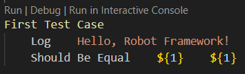

# RobotFramework-Dir

## Repository Structure

This repo is organized into multiple folders:
- [] `RobotScripts` : Contains the main robot test files 
- [] `CustomLibs`   : Contains custom-created libraries
- [] `Screenshots`  : Contains screenshots of the steps how we've written the tests

## Steps

- [1] Create a robot framework with the following minimum file structure:

```
*** Test Cases ***
First Test Case Title
    <First Keyword>     <Argument>
    <Second Keyword>    <First Arugment>    <Second Arugment>

Second Test Case Title
    <First Keyword>     <Argument>          <Second Arugment>
    <Second Keyword>    <First Arugment>    <Second Arugment>
```

- [2] To run a single test case, you can click on the `Run | Debug` option provided throug hthe RobotFramework extension



- [3] To run multiple test cases at the same time, you can run the following command in the terminal `robot ./folder-name`. This will run all of the .robot files within that folder with all of test cases contained in them.


- [4] After every run of the test, a report, a log and an output files will eb generated that contain all of the information about the tests run. Here's an exampel of what a report looks like:


- [5] Adding variables to the mix

```
*** Variables ***
${WELCOME-MSG}     Hello, Robot Framework!
${SUCC-MSG}        Numbers are equal!
${FAIL-MSG}        Numbers are NOT equal!

*** Test Cases ***
First Test Case (Successful)
    Log    ${WELCOME-MSG}
    Should Be Equal    ${1}    ${1}
    Log   ${SUCC-MSG}

Second Test Case (Fail)
    Log    ${WELCOME-MSG}
    Should Be Equal    ${1}    ${2}
    Log    ${FAIL-MSG}
```

- [6] Using custom libraries

Robot file:
```
*** Settings ***
Library                ../CustomLibs/hello-world.py   

*** Test Cases ***
Using the Custom Library
    Hello World
```

Python file:
```
def hello_world():
    print("Hello, World!")
```

## RQs::

- [] Keywords are case-insensitive and can be written with spaces. For example, Hello World will match a method named hello_world.
- [] To put the logs/reports in a specific folder you need to add the following argument when running the script `--outputdir <directory-name>`

## Documentation & useful resources/links

- [ ] [Create](https://docs.gitlab.com/ee/user/project/repository/web_editor.html#create-a-file) or [upload](https://docs.gitlab.com/ee/user/project/repository/web_editor.html#upload-a-file) files